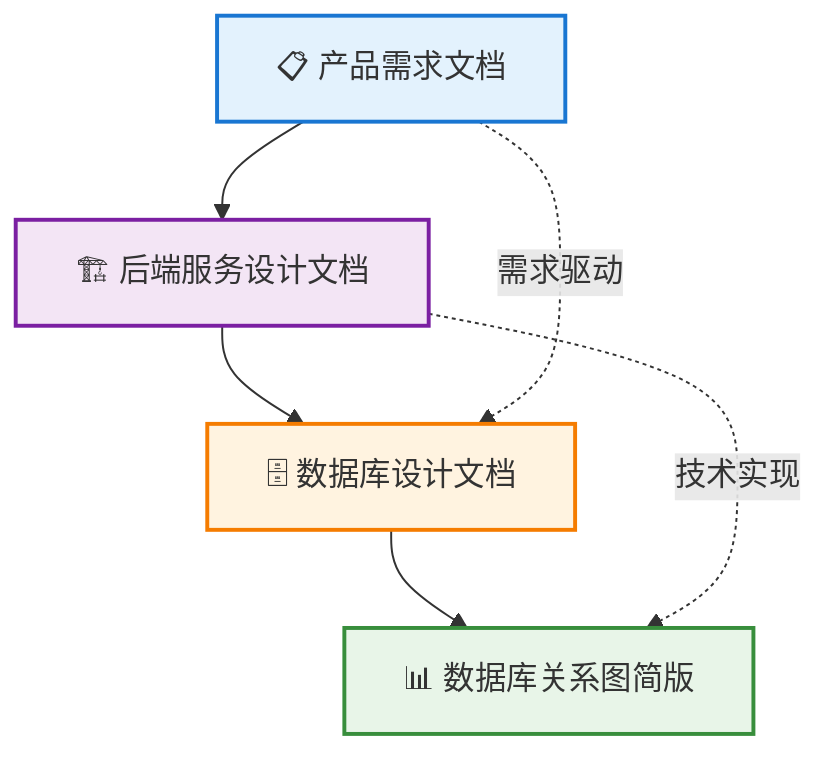

# 坚持有你 - 项目文档索引

## 📋 文档目录

### 🎯 需求与设计文档

#### 1. [产品需求文档](./产品需求文档.md)

- **内容**: 完整的产品功能需求和业务流程
- **包含**: 用户故事、功能模块、UI/UX设计要求
- **适用**: 产品经理、设计师、开发团队

#### 2. [后端服务设计文档](./后端服务设计文档.md)

- **内容**: 技术架构、API设计、系统集成方案
- **包含**: 服务架构、接口规范、安全设计
- **适用**: 后端开发工程师、架构师

### 🗄️ 数据库设计文档

#### 3. [数据库设计文档](./数据库设计文档.md) ⭐

- **内容**: 完整的数据库设计文档
- **包含**:
  - 📊 详细的ER关系图
  - 📋 表结构和字段说明
  - 🚀 索引设计策略
  - 🔐 数据安全设计
  - 📈 性能优化建议
- **适用**: 数据库设计师、后端开发工程师

#### 4. [数据库关系图简版](./数据库关系图简版.md) 🎯

- **内容**: 核心表关系的可视化图表
- **包含**:
  - 🔗 核心表关系图 (Mermaid格式)
  - 📋 表功能说明
  - 🎯 业务流程路径
- **适用**: 快速理解数据库结构的所有角色

## 🔄 文档关系图



## 🎯 快速导航

### 对于产品经理

1. 📋 [产品需求文档](./产品需求文档.md) - 了解完整功能需求
2. 📊 [数据库关系图简版](./数据库关系图简版.md) - 理解数据模型

### 对于前端开发

1. 📋 [产品需求文档](./产品需求文档.md) - 理解业务需求
2. 🏗️ [后端服务设计文档](./后端服务设计文档.md) - 查看API接口设计

### 对于后端开发

1. 🏗️ [后端服务设计文档](./后端服务设计文档.md) - 技术架构设计
2. 🗄️ [数据库设计文档](./数据库设计文档.md) - 完整数据库设计
3. 📊 [数据库关系图简版](./数据库关系图简版.md) - 快速理解表关系

### 对于测试工程师

1. 📋 [产品需求文档](./产品需求文档.md) - 理解测试需求
2. 🏗️ [后端服务设计文档](./后端服务设计文档.md) - 了解API接口

## 📊 项目核心数据模型

### 主要业务实体

- 👤 **用户 (User)** - 微信授权用户、个人档案
- 📅 **断食计划 (FastingPlan)** - 168断食配置
- 📝 **断食记录 (FastingRecord)** - 每日断食执行情况
- ⚖️ **体重记录 (WeightRecord)** - 体重变化追踪
- 🏆 **成就系统 (Achievement)** - 激励机制
- 💕 **情侣关系 (CoupleRelation)** - 用户互动
- 🍽️ **饮食记录 (FoodRecord)** - 饮食管理
- 🔔 **消息通知 (Notification)** - 推送提醒

### 数据库技术栈

- **数据库**: MySQL 8.0+
- **ORM**: Prisma
- **缓存**: Redis
- **文件存储**: 腾讯云COS

## 🚀 开发流程

### 1. 需求理解阶段

```
产品需求文档 → 业务流程梳理 → 功能模块划分
```

### 2. 技术设计阶段

```
后端架构设计 → 数据库建模 → API接口设计
```

### 3. 开发实现阶段

```
数据库创建 → 后端服务开发 → 前端交互实现
```

### 4. 测试部署阶段

```
单元测试 → 集成测试 → 性能测试 → 生产部署
```

## 📝 文档维护

### 更新频率

- **产品需求文档**: 需求变更时更新
- **技术设计文档**: 架构调整时更新
- **数据库设计文档**: 数据模型变更时更新

### 版本管理

- 所有文档遵循语义化版本控制
- 重大变更需要更新版本历史
- 保持文档与代码的同步更新

---

**文档维护团队**: 开发团队  
**最后更新**: 2024-12-19  
**文档版本**: v1.0
