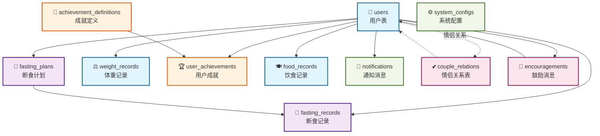

# 坚持有你 - 数据库关系图 (简化版)

## 📊 核心表关系图



## 🔗 表关系类型说明

### 一对多关系 (→)

- `users` → `fasting_plans` - 用户创建多个断食计划
- `users` → `fasting_records` - 用户每天一条断食记录
- `users` → `weight_records` - 用户每天一条体重记录
- `users` → `user_achievements` - 用户获得多个成就
- `users` → `food_records` - 用户记录多条饮食
- `users` → `notifications` - 用户接收多条通知
- `fasting_plans` → `fasting_records` - 计划生成多条记录
- `achievement_definitions` → `user_achievements` - 成就定义对应多个用户成就

### 多对多关系 (-.->)

- `users` ↔ `users` (通过 `couple_relations`) - 用户间的情侣关系
- `users` ↔ `encouragements` - 用户间互发鼓励消息

### 自引用关系

- `couple_relations` 表连接两个用户，形成情侣关系
- `encouragements` 表连接发送者和接收者用户

## 📋 核心表功能说明

| 表名                        | 功能描述     | 关键特性                     |
| --------------------------- | ------------ | ---------------------------- |
| **users**                   | 用户基础信息 | 微信登录、个人档案、情侣绑定 |
| **fasting_plans**           | 断食计划配置 | 168断食、自定义时间窗口      |
| **fasting_records**         | 断食执行记录 | 每日状态、完成情况、心情记录 |
| **weight_records**          | 体重变化记录 | 体重趋势、BMI计算、照片对比  |
| **achievement_definitions** | 成就规则定义 | 成就类型、解锁条件、积分奖励 |
| **user_achievements**       | 用户成就进度 | 解锁状态、完成进度、时间记录 |
| **couple_relations**        | 情侣关系管理 | 邀请机制、状态管理、权限控制 |
| **encouragements**          | 相互鼓励消息 | 文字鼓励、表情支持、已读状态 |
| **food_records**            | 饮食记录     | 餐次分类、饱腹感、心情记录   |
| **notifications**           | 推送通知     | 微信模板、定时提醒、状态追踪 |
| **system_configs**          | 系统配置     | 动态参数、功能开关、公开配置 |

## 🎯 业务流程核心路径

### 1. 用户注册流程

```
微信授权 → users表创建 → 生成invite_code → 个人档案完善
```

### 2. 断食管理流程

```
创建计划(fasting_plans) → 开始断食(fasting_records) → 状态追踪 → 完成记录
```

### 3. 情侣绑定流程

```
生成邀请码 → 分享给对方 → 创建couple_relations → 确认关系 → 数据同步
```

### 4. 成就解锁流程

```
用户行为 → 触发检测 → achievement_definitions规则匹配 → 更新user_achievements → 推送通知
```

### 5. 体重管理流程

```
每日称重 → weight_records记录 → BMI计算 → 趋势分析 → 目标进度更新
```

---

**设计原则**:

- 🔐 数据安全 - 外键约束、级联删除
- 📈 性能优化 - 复合索引、查询优化
- 🔄 扩展性 - 模块化设计、JSON配置
- 💾 数据完整性 - 唯一约束、业务验证
